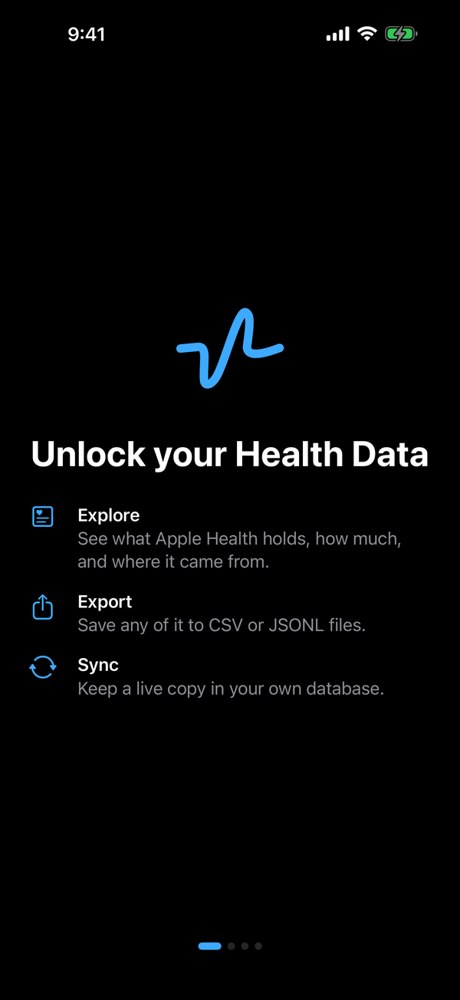
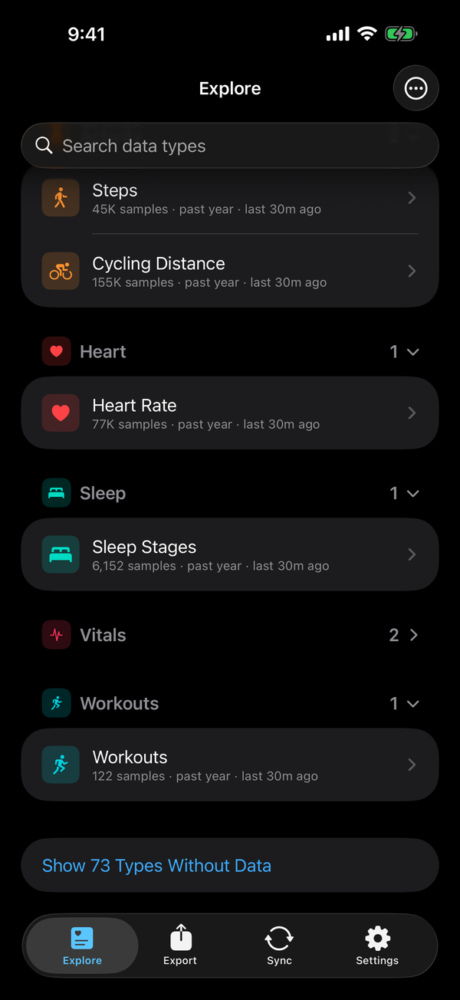
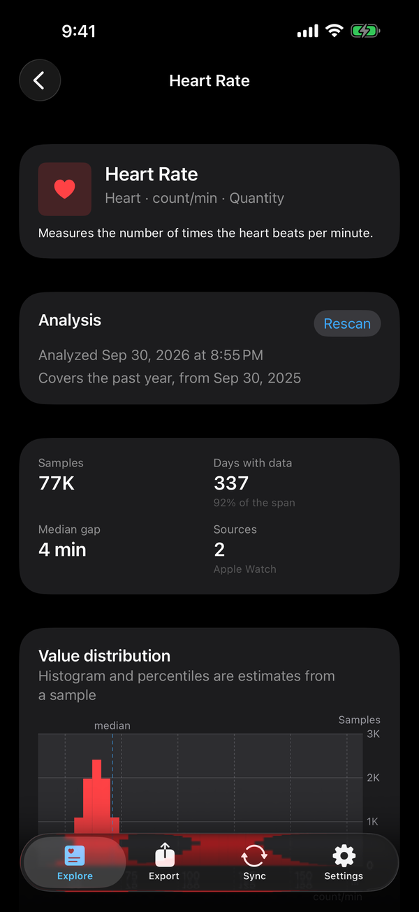
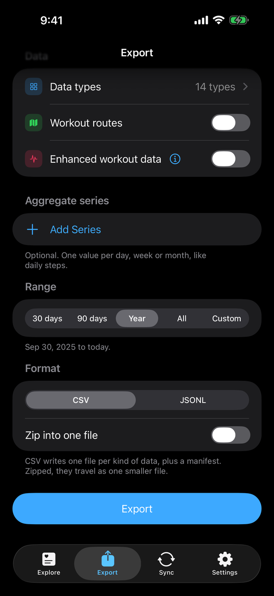
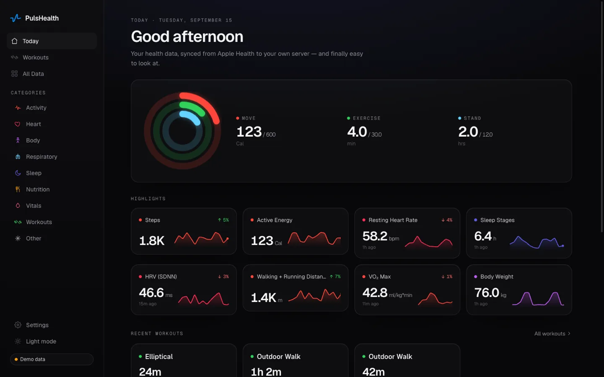
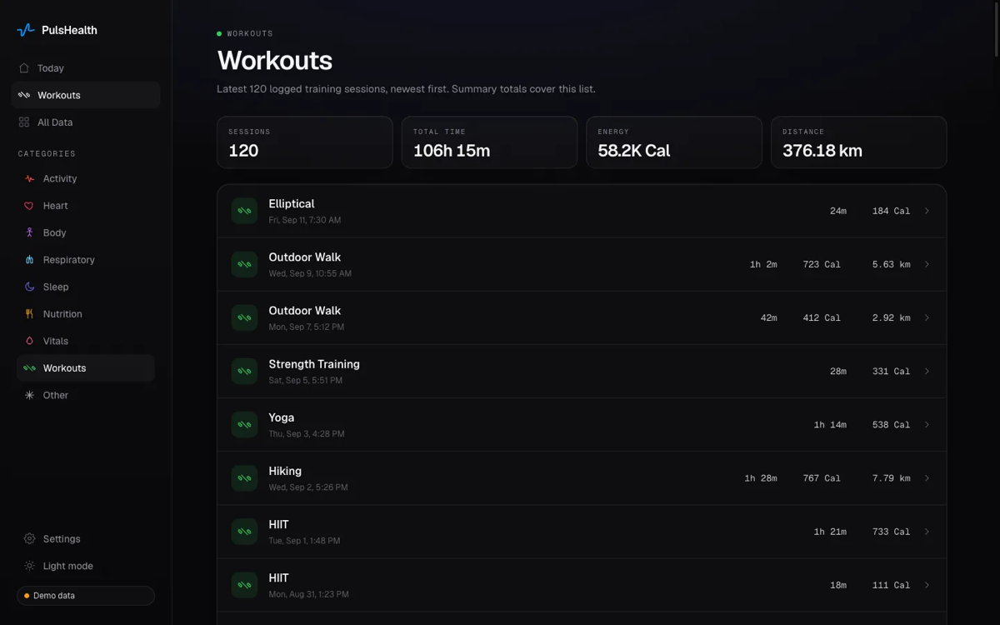
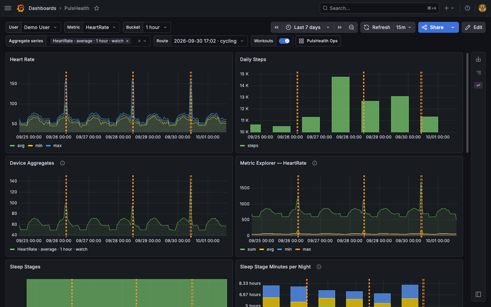

# PulsHealth

Sync Apple Health to a backend you control, then use the data with your own
tools — SQL, Grafana, notebooks, and AI assistants.

PulsHealth is an iOS app, and the Swift package underneath it, that reads
HealthKit and streams every sample — a full historical backfill first, then
near-real-time updates — as gzip NDJSON to an HTTP endpoint you configure.
Nothing is sent anywhere else. This repository also holds the sync protocol's
specification and a reference backend that runs with one `docker compose up`:
PostgreSQL 17 + TimescaleDB, a Go ingest server, a read-only product API with
an OpenAPI document, Grafana dashboards, a web viewer, and an MCP server so
Claude, Cursor and other AI assistants can answer questions from your data.

**[PulsHealth is on the App Store](https://apps.apple.com/us/app/pulshealth/id6757657354)** —
free, iPhone and iPad. The backend is yours to run; see [Quickstart](#quickstart).

**No server? Explore and export.** The **Explore** tab shows what Apple Health
holds for every type: how many samples, since when, from which apps and
devices, the spread of values against the type's typical range, a chart over
time, and what the type measures. The **Export** tab writes the types and
series you choose straight from HealthKit to CSV or JSONL (the sync protocol
itself, replayable into a server later), for a preset range or dates of your
own, and hands the files to the share sheet. Nothing is uploaded. Formats and
columns are in [`docs/export.md`](docs/export.md#on-device-export-no-server).

> **The backend is pre-release (0.x).** The app ships from the App Store, but
> standing up the server it syncs to expects someone comfortable with Docker.
>
> - The wire protocol, the **Puls Sync Protocol v1**, is specified in
>   [`docs/protocol/`](docs/protocol/README.md) with JSON Schema and a fixture
>   corpus. It is young: expect clarifications, and report gaps through the
>   "Backend implementer question" issue template.
> - **Backups are opt-in and off by default.** Until you enable the `backup`
>   Compose profile (or run `make backup`), your Postgres volume is the only
>   copy of your data, and only the restore drill in `server/README.md`
>   ("Backup & restore") verifies a dump.
>
> What is still outstanding is [`docs/roadmap.md`](docs/roadmap.md).

## Components

| Component | Path | What it is |
|---|---|---|
| **iOS app** | [`PulsHealth/`](PulsHealth/README.md) | SwiftUI app over the package, in four tabs: **Explore** (every HealthKit type by category, each with a page of analysis charts, an aggregate preview and the type's typical range), **Export** (types, aggregate series, any date range, CSV or JSONL — no server needed), **Sync** (the database connection, backfill progress and ETA, per-type status, the event log and background-activity telemetry) and **Settings** (user, sync tuning, privacy and data, diagnostics). |
| **`PulsHealthSync`** | [`PulsHealthSync/`](PulsHealthSync/README.md) | Swift package (iOS 17+, Swift 6 strict concurrency, zero dependencies): anchored-query sync engine, on-device aggregates, activity rings, background scheduling, HTTP transport, NDJSON encoding, on-device export. Embeddable in other apps. |
| **Reference server** | [`server/`](server/README.md) | Docker Compose stack: TimescaleDB, Go ingest API, Go product API (OpenAPI 3.1), Grafana with provisioned dashboards and alert rules. |
| **Web viewer** | [`web/`](web/README.md) | Next.js viewer (activity rings, trends, workouts, catalog) reading Postgres directly. |
| **Marketing site** | [`site/`](site/README.md) | Next.js static export behind pulshealth.com: product pages, this repository's documentation (`/docs`), the blog, and the knowledge-base viewer. Distinct from `web/`. |
| **Knowledge base** | [`knowledge-base/`](knowledge-base/README.md) | 178 YAML files describing every HealthKit type — what it measures, how it is interpreted, typical and notable ranges, sources. Read by `site/` and bundled into the app. |
| **Blog** | [`blog/`](blog/BLOG_SYSTEM.md) | The site's MDX posts and their images. |
| **Protocol** | [`docs/protocol/`](docs/protocol/README.md) | The Puls Sync Protocol v1 specification, JSON Schema, fixture corpus, a checker (`tools/protocol-check/`), and a minimal Python + SQLite receiver (`examples/receivers/python-sqlite/`). |
| **MCP server** | [`server/mcp/`](server/mcp/README.md) | Read-only MCP server over the product API for Claude Desktop, Claude Code, Cursor and remote connectors, with an embedded guide for the model. Setup in [`docs/ai.md`](docs/ai.md). |

<p align="center">
  
  
  
  
</p>

The iOS app 1.6: the first run, Explore, a Type page and the Export builder,
taken in the simulator with the app's built-in demo data (nobody's real health
data).

<p align="center">
  
  
</p>

<p align="center">
  
</p>

The self-hosted web viewer (`web/`, Today and Workouts) and the provisioned
Grafana dashboard (`server/grafana/`), both filled with generated demo data:
the viewer's own local demo mode and a throwaway stack seeded through ingest
with synthetic batches. No screenshot in this repository shows anyone's real
health data.

The database's data model, table guide and query patterns (including how to
avoid iPhone + Watch double counting) are in
[`docs/database-guide.md`](docs/database-guide.md).

## Architecture

```
┌────────────── iPhone ──────────────┐      ┌────────── your server ──────────┐
│ HealthKit store                    │      │                                 │
│   │ HKAnchoredObjectQuery (paged)  │      │  ingest (Go) ──► PostgreSQL 17  │
│   ▼                                │ HTTPS│   bearer auth     + TimescaleDB │
│ HealthSyncEngine (actor)           │─────►│   gzip NDJSON     hypertables,  │
│   per-type anchors, TaskGroup ×4   │      │   idempotent      compression   │
│   gzip NDJSON batches              │      │        │                        │
│   HKObserverQuery + bg delivery    │      │        ▼                        │
│   BGProcessingTask catch-up        │      │  product API · Grafana · web    │
└────────────────────────────────────┘      └─────────────────────────────────┘
```

The app only ever talks to the URL you enter. Any HTTP server that accepts
the batch format can stand in for the reference stack — see
[Bring your own backend](#bring-your-own-backend).

## Quickstart

### Server

You need a Linux or macOS host with Docker (and its Compose plugin), `openssl`
and `curl`.

```bash
git clone https://github.com/PulsHealth/pulshealth.git
cd pulshealth
scripts/bootstrap.sh --time-zone Europe/Berlin   # the zone your phone lives in
```

That creates `server/.env` with every secret generated, starts the stack
(`docker compose up -d`, which pulls the published images from
`ghcr.io/pulshealth` and runs the `migrate` service before anything else),
waits for ingest to answer, and prints a **pairing block**: the URL the phone
should use, the bearer token, the user ID, and a QR code encoding all three
(drawn by `qrencode` if you have it, otherwise by the ingest container).
Without `--time-zone` it uses the host's zone and says so; every daily view
buckets by this calendar, so it must match the phone's. `make pairing` prints
the block again, and `scripts/bootstrap.sh --issue-device "My iPhone"` prints
one for a token of that phone's own instead of the shared one
([per-device tokens](server/README.md#tokens)).

Then decide how the phone reaches the server. Until you do, ingest listens on
`127.0.0.1` only, where no phone can reach it, and the pairing block's URL
reads `(none yet)` with no QR code. Re-run the script with one of these (it
changes only that setting):

- **Same Wi-Fi:** `scripts/bootstrap.sh --lan` binds ingest to every
  interface (`INGEST_BIND_ADDR=0.0.0.0`) and puts `http://<this host's LAN
  IP>:8080` in the pairing block; the app accepts plain `http://` for
  local-network addresses. The token is then the only protection, so use it
  only on a network you control.
- **From anywhere:** put a TLS-terminating proxy or Tailscale Serve/Funnel in
  front of port 8080 (`server/README.md`, "Exposing the server") and pass its
  URL: `scripts/bootstrap.sh --url https://health.example.net`. Ingest stays
  on loopback and the QR code carries the HTTPS URL.

Everything else binds to loopback on fixed host ports, which must be free: the
product API on `8081`, the MCP server on `8082`, Grafana on `3000`, the web
viewer on `3001`, Postgres on `5432`. Re-running `scripts/bootstrap.sh` never
regenerates secrets. `make up`, `make down`, `make logs` and `make ps` wrap
Compose (`make help` lists the rest). To upgrade, `git pull && make pull up`:
the compose file and the schema migrations come from the checkout, so it moves
with the images (`CHANGELOG.md` says what each release needs).
[`server/README.md`](server/README.md) covers configuration, images and
versions, schema migrations, the database roles and Grafana.

To run the code in your checkout instead of the published images (after a
change in `server/` or `web/`), use `make dev-up`, or `scripts/bootstrap.sh
--build` on a first run: both build the four app images through the
`server/compose.build.yml` overlay.

### App

Install it from the App Store:
**[PulsHealth](https://apps.apple.com/us/app/pulshealth/id6757657354)**, free.

To build it from source you need Xcode 26 or later,
[XcodeGen](https://github.com/yonaskolb/XcodeGen), and, for a real iPhone, a
paid Apple Developer team (the HealthKit background-delivery entitlement
requires one).

```bash
brew install xcodegen
cd PulsHealth
xcodegen          # generates PulsHealth.xcodeproj; seeds Config/Local.xcconfig
open PulsHealth.xcodeproj
```

Put your Team ID in `PulsHealth/Config/Local.xcconfig` (gitignored, like the
generated project), select your device, and run.

In the app:

1. Swipe through the first run and grant Health access when asked (the app is
   read-only; it never writes to HealthKit). It asks about a "Common" starter
   set; add more types later under **Sync → Synced Data**. It does not ask for
   a database.
2. **Sync tab → Set Up** (later, **Sync → Database**): scan the pairing
   block's QR code with **Scan Pairing Code**, paste its `puls://pair?…` line
   with **Paste Pairing Code**, or type the **Database URL** and **Token**.
   The iOS Camera app works too: it offers to open PulsHealth, which asks you
   to confirm the host before it fills anything in. Then tap **Test
   Connection** and **Save & Apply**.
3. **Sync → Synced Data:** adjust what to sync and tap Apply. New types
   backfill from your chosen start date; the Sync tab shows per-type progress,
   rate and ETA.

Open the web viewer at `http://localhost:3001` on the server, or Grafana at
`http://localhost:3000`, and watch the data arrive.

Without step 2 the app syncs nothing and the Sync tab shows a setup card
instead of a status; Explore and Export work regardless.

**Several people on one server.** Every install starts with the same default
user ID, so give each phone its own under **Settings → User**, and its own
token with `scripts/bootstrap.sh --issue-device "<label>" --user <that user
ID>`, which ends in a QR code for that phone. A device token is bound to its
user, so no phone can write as another. Reads default to `PULS_USER_ID`;
`PULS_MULTI_USER=true` in `server/.env` lets the product API answer for any
user a request names (`?user=<uuid>`, listed by `GET /v1/users`), which the
MCP server and the web viewer use to pick whose data you see. It is off by
default because the API's one token then reads everyone.

## Use it with AI

The stack includes a read-only [MCP](https://modelcontextprotocol.io) server
(`server/mcp/`) so an AI assistant can answer questions from your data: "how
many steps did I average last week", "compare my runs this month to last
month", "did I close my rings yesterday". It talks only to the product API,
returns deduplicated daily values with their units, and carries a guide for
the model on the data's traps (iPhone + Watch double counting, cumulative
versus discrete metrics, the time-zone rule). Its tools cover users, a recent
summary, the profile, the type catalogue, latest and daily metrics, activity
rings, workouts and their intra-workout series, raw samples, sleep, and state
of mind.

Local clients (Claude Desktop, Claude Code, Cursor) run the binary in stdio
mode against your API; in Claude Code, for example:

```bash
go build -o pulshealth-mcp ./server/mcp
claude mcp add pulshealth -s user \
  -e PULS_API_URL=https://<your-api-host>:8444 \
  -e PULS_API_TOKEN=<PULS_API_TOKEN from server/.env> \
  -e PULS_TIME_ZONE=Europe/Berlin \
  -- "$PWD/pulshealth-mcp"
```

Remote clients connect to the Compose `mcp` service over HTTPS with
`PULS_MCP_TOKEN`. [`docs/ai.md`](docs/ai.md) has the config for every client,
the remote-connector recipe, demo prompts, the security notes, and the
ChatGPT route (the API's `/openapi.json` as a custom GPT Action).

For a whole range as a *file* rather than an answer in a chat,
`GET /v1/export` streams any dataset as CSV or JSONL and `tools/puls-export`
is a small CLI for it: [`docs/export.md`](docs/export.md).

## How syncing works

The mechanics are in [`PulsHealthSync/README.md`](PulsHealthSync/README.md);
in short:

- **Per-type cursors.** Each HealthKit type has its own `HKQueryAnchor`,
  persisted only *after* the server confirms the batch. A crash or failed
  upload re-sends the same page, and the server deduplicates by sample UUID
  (`ON CONFLICT DO NOTHING`), so the pipeline is idempotent end to end.
- **Backfill** is the same anchored paging loop from a nil anchor, bounded by
  your start date: 1,000-sample pages, four types at a time (HealthKit query
  throughput degrades beyond that), resumable at any page. Workouts' GPS
  routes and intra-workout series come in later phases, so one large workout
  cannot stall the rest.
- **Recent data first.** A backfill sends activity rings first, then the last
  30 days of each aggregate series (the server's daily views need an
  aggregate line before they show anything), then the last 30 days of each
  raw type, then the raw history — the heaviest type (heart rate) from the
  start, the rest cheapest-first — and finally the full aggregate pass and
  workout routes and series. Batches therefore arrive out of chronological
  order, which the [protocol](docs/protocol/README.md) requires receivers to
  accept.
- **Incremental sync** merges one page per changed type into shared uploads,
  never splitting a page across batches, so anchor-after-ack still holds.
- **Real-time** is one multi-type `HKObserverQuery` plus
  `enableBackgroundDelivery(.immediate)`. When HealthKit wakes the app it
  drains changes, including **deletions**, which anchored queries report as
  tombstones and the server applies as `DELETE`s.
- **On-device aggregates** (optional, per type): `HKStatisticsCollectionQuery`
  buckets — sums, averages, minima, maxima — by hour, day, week or month, and
  optionally per device (Watch vs. iPhone). They have no UUIDs, so the server
  upserts them, and each run recomputes a trailing window so late Watch data
  corrects itself.
- **Activity rings** (`HKActivitySummary`) sync as one upserted row per day,
  refreshed on every sync run and at most hourly off observer wakes.
- **Safety nets:** a `BGProcessingTask` runs periodic catch-up syncs when the
  device is idle, and every foreground open runs a full incremental pass —
  the most reliable trigger iOS offers. On iOS 26 a user-initiated backfill
  runs as a `BGContinuedProcessingTask`, so it keeps going with system
  progress UI after you leave the app.
- **Reconciliation:** HealthKit may purge deletion tombstones before a sync
  sees them. A type's sync details can compare per-UTC-month UUID digests
  with the server (`GET /v1/digest`), re-upload anything missing, and delete
  server-side orphans — never from a month HealthKit returned nothing for,
  since a type whose Health access is off reads exactly like one with no data.
- **Locked devices:** HealthKit is unreadable while the phone is locked.
  Background wakes that find it locked are recorded as *skipped*, and the next
  unlock or app open catches up.
- **Limited history (iOS 27):** a type the user shares only from the past 30
  days is read from that date. Passes that overwrite server data stay inside
  it, and widening access later re-reads the type's history.

### Wire format

`POST /v1/batches` with `Authorization: Bearer <token>`, `Content-Encoding:
gzip`, `X-Puls-Protocol: 1`, and an `X-User-ID` header naming the user. The
body is NDJSON: a header line (batch and device IDs, protocol and client
version, per-line-type counts), then samples, deletions, workout routes and
intra-workout series, aggregate buckets, activity summaries, and an optional
profile line. Samples are quantities, categories, workouts (with effort
scores), heartbeat series, ECGs, State of Mind logs and medication doses.
Every quantity is in one canonical unit per type; every timestamp is epoch
milliseconds.

Any **2xx** acknowledges the batch and advances the anchor. **4xx** is never
retried (the anchors stay put, so nothing is lost, but the type stalls until
the server accepts it); **5xx**, **429** and network errors are retried with
jittered exponential backoff. Retried batches are no-ops server-side. The
normative description is the [Puls Sync Protocol v1](docs/protocol/README.md);
the reference server's limits and a runnable `curl` example are in
[`server/README.md`](server/README.md).

### Bring your own backend

The app posts to a URL; the reference stack is one receiver, not the only
one. A receiver accepts the batch, deduplicates samples by UUID, upserts
aggregate buckets and activity summaries by their identity, and returns 2xx.
The **Puls Sync Protocol v1** under [`docs/protocol/`](docs/protocol/README.md)
has everything it must do: the transport and retry contract, every line type
with a JSON Schema, the canonical units, the idempotency rules, a
minimal-receiver checklist, and a fixture corpus with the counts a reference
server returns.

- [`examples/receivers/python-sqlite/`](examples/receivers/python-sqlite/README.md)
  is a complete receiver in one standard-library Python file writing to
  SQLite. Its `smoke_test.py` posts the whole corpus to **any** receiver URL
  and checks the responses.
- [`tools/protocol-check/`](tools/protocol-check/) validates captured batches
  against the schemas and the framing rules.
- The optional read endpoints (`/v1/capabilities`, `/v1/stats`, `/v1/digest`,
  `/v1/uuids`) back the app's connection test, server counts and
  reconciliation, and can be left out; the app probes a receiver without
  `/v1/capabilities` with an empty batch.

Gaps in the spec go in the "Backend implementer question" issue template.

## Performance expectations

Measure your own device with **Settings → Diagnostics → Run Throughput
Benchmark** (reads real HealthKit data through a discarding transport; does
not touch sync state). Planning numbers:

**Initial backfill** (foreground, plugged in, LAN or VPN to the server):

| Profile | Volume | Expected duration |
|---|---|---|
| Casual iPhone-only user, 5 years | ~1–2 M samples | **2–6 min** |
| Apple Watch wearer, 3 years | ~5–10 M samples (heart rate at ~3.5 K/day dominates) | **15–40 min** |
| Heavy Watch user (daily workouts), 5+ years, all types | ~15–25 M samples | **45–90 min** |

Device-side HealthKit reads are the bottleneck (~3–10 K samples/s per type on
recent iPhones); the server ingests 50–100 K rows/s, so it never queues.
Backfills pause if iOS suspends the app and resume on the next open without
losing progress.

**Settings → Performance** sets the batch size (250–5,000) and type
concurrency (1–8). The defaults (1,000 × 4) are field-tested; larger batches
help on high-latency links, smaller ones reduce memory and re-upload cost
after failures.

**Event → queryable-in-database latency** (steady state):

| Data path | Typical latency | Why |
|---|---|---|
| Written on iPhone, immediate-class type (workouts, body mass, HRV, …) | **seconds** (≈1–10 s) | `.immediate` background delivery is honoured |
| Steps / active energy / distance (iPhone) | **up to ~1 h** | iOS silently limits background delivery for these types to about hourly |
| Anything recorded on Apple Watch | **minutes–hours** | Watch → iPhone HealthKit sync is opportunistic and Apple provides no API to force it. Opening the app (or charging the Watch) usually triggers it |
| Device locked | deferred | The Health database is encrypted ~10 min after lock; the next unlock or wake catches up |
| App force-quit by the user | until the next app open | iOS stops waking force-quit apps |
| Activity rings | next sync run, at most hourly off observer wakes | Activity summaries are not observable and have no background delivery; the current day is re-queried on every run and upserted |

Upload plus ingest adds under a second on a LAN. A type's **Sample to upload
latency** (in its sync details) shows the number you are actually getting.

## FAQ

**My Watch data arrives minutes or hours late.**
Watch → iPhone HealthKit transfer is scheduled by watchOS and cannot be
forced by any app. Opening PulsHealth, or putting the Watch on its charger,
usually prompts it. Once the data is on the phone it syncs normally.

**Steps, active energy, and distance lag by up to an hour, while workouts
appear in seconds.**
iOS throttles "immediate" background delivery for those high-frequency types
to roughly hourly, without saying so, and it is not configurable. Anything
else you record on the phone, and every foreground open, syncs right away.

**Nothing synced overnight.**
While the phone is locked HealthKit is unreadable, and iOS prefers to run
background processing when the device is idle — locked, overnight. PulsHealth
records those wakes as *skipped (locked)* on the Background Activity screen
and catches up at the next unlock or app open.

**I swiped the app away and it stopped syncing.**
iOS does not wake force-quit apps for background delivery or scheduled
tasks. Open the app again and it resumes; leaving it in the app switcher is
enough.

**Blood pressure never shows up in the permission sheet.**
On iOS 26 the Health permission sheet silently omits blood pressure
systolic/diastolic (Apple Feedback FB22735935); iOS 27 fixes it. On iOS 26,
grant them in **Settings → Privacy & Security → Health → PulsHealth**; the app
shows a hint when it detects this and backfills the full history once access
exists.

**Daily step totals in the database are higher than the Health app shows.**
The iPhone and the Watch both record steps, and a naive sum of raw samples
counts both. Use the `metric_daily` view (or an on-device aggregate series,
which HealthKit already de-duplicates) instead of summing `quantity_samples`.
`docs/database-guide.md` explains the query patterns.

**Can I sync to a database I already have?**
Yes — anything that speaks the sync protocol is a valid destination; see
[Bring your own backend](#bring-your-own-backend).

**Does it write anything into Apple Health?**
No. The app requests read access only, and its usage strings say so.

## Observability

- **App → Sync:** the server's status, samples and bytes sent, backfill
  progress and ETA, and a row per type that opens its sync details — anchor
  presence, backfill state, counters, earliest/latest sample dates, last sync
  time and duration, live rate and ETA, last error.
- **App → Sync → Activity → Log:** a filterable live event stream, persisted
  across launches and mirrored to `os.Logger` (`log stream --predicate
  'subsystem == "com.pulsHealth.healthsync"'` from a Mac). **Activity →
  Background** keeps one durable record per wake (trigger, duration, outcome,
  work done, Low Power Mode, thermal state) and exports them.
- **Instruments:** signposts (`syncAll`, `syncType`) profile every phase.
- **Server:** structured JSON logs per batch (counts, bytes, parse/insert
  timings); a PulsHealth dashboard for the health data and an Ops dashboard
  for ingest health with provisioned alert rules; `GET /v1/stats` returns
  per-type row counts to cross-check against the app.

## Security notes

The full list of design properties, and how to report a vulnerability, is in
[`SECURITY.md`](SECURITY.md).

- **Your data goes only to your server.** There is no PulsHealth service, no
  analytics, no crash reporting.
- **An export is a file you hand over yourself.** The Export tab makes no
  network request: it stages files in the app's temporary directory (never
  backed up), hands them to the share sheet, and deletes its copy once the
  share completes, when another export starts, and at every launch. The files
  are not encrypted and carry no token.
- **Bearer tokens.** Ingest accepts a shared static `PULS_TOKEN` — whoever
  holds it can upload and delete data for any user ID — and per-device tokens
  (`make devices ARGS='issue --user <uuid> --name <label>'`), hashed at rest,
  bound to one user and revocable one at a time. Set
  `PULS_ALLOW_SHARED_TOKEN=false` once every phone has its own. On the phone
  the token is in the Keychain (`kSecAttrAccessibleAfterFirstUnlockThisDeviceOnly`:
  background wakes can read it, a backup cannot carry it to another device).
  Ingest rate-limits failed authentications per client IP and never throttles
  a request with the right token (`server/README.md`, "Rate limiting").
- **Put the ingest endpoint behind TLS.** Every service binds to loopback by
  default. Expose only the ingest port, through a TLS-terminating proxy or a
  VPN; `scripts/bootstrap.sh --lan` is the one plain-HTTP exception, for a
  network you control. Never publish the product API, Grafana or Postgres on
  a public interface.
- **The MCP server's tokens read everything the product API serves.** Publish
  it only over HTTPS and keep client config files that hold a token out of
  version control (`docs/ai.md`).
- **The web viewer's login is optional.** `WEB_AUTH_PASSWORD`, which
  `scripts/bootstrap.sh` generates on a fresh install, puts every page behind
  HTTP Basic; without it the viewer is open to anyone who can reach it. Either
  way keep `WEB_BIND_ADDR` on loopback or a private network.
- **The database holds identifiable data** (name, email, date of birth, sex
  next to the samples). Ingest connects as the scoped DML-only `ingest` role,
  never as the superuser (`server/README.md`, "The scoped `ingest` role").

## What this is not

- **Not a hosted service.** Nobody runs a PulsHealth server for you, and
  that is deliberate.
- **Not on Android.** The v1 type vocabulary is HealthKit's. The protocol is
  platform-neutral in shape, so a Health Connect client is possible, but none
  is planned here.
- **Not a writer.** It never modifies HealthKit data.
- **Not a sink for every cloud.** The app speaks HTTP to one URL; S3, Google
  Sheets, Notion and similar are a receiver's job, not the app's.

## Development

[`CONTRIBUTING.md`](CONTRIBUTING.md) has the setup and test commands for every
component, the integration tests, and the rules that keep the app and server
in step; `make dev-up` runs the whole stack from this checkout.
[`CLAUDE.md`](CLAUDE.md) lists the invariants (anchor-after-ack, canonical
units, epoch milliseconds everywhere, upsert versus never-overwrite) and the
HealthKit gotchas; it is written for AI coding agents and is worth reading
regardless. [`AGENTS.md`](AGENTS.md) is the short orientation for an automated
contributor, and [`llms.txt`](llms.txt) indexes the documentation.

## Contributing, security, license

- [`CONTRIBUTING.md`](CONTRIBUTING.md) — DCO sign-off, per-component setup,
  what to run before a pull request. Issue templates cover bugs, feature
  requests, and questions from people implementing their own receiver.
- [`SECURITY.md`](SECURITY.md) — private vulnerability reporting and scope.
- [`docs/privacy-policy.md`](docs/privacy-policy.md) — what the app reads,
  where it sends it (only your server), and what stays on the phone.
  [`docs/appstore/`](docs/appstore/README.md) holds the App Store listing copy,
  review notes, the recipe for the throwaway review backend, and the release
  record.
- [`CODE_OF_CONDUCT.md`](CODE_OF_CONDUCT.md) — Contributor Covenant.
- [`LICENSE`](LICENSE) — Apache License 2.0, for everything in this
  repository. [`NOTICE`](NOTICE) carries the attribution.
- [`TRADEMARK.md`](TRADEMARK.md) — the PulsHealth name, icon, and App Store
  listing are reserved; forks ship under their own name and bundle
  identifier; "works with PulsHealth" and "implements the Puls Sync
  Protocol" are welcome.
